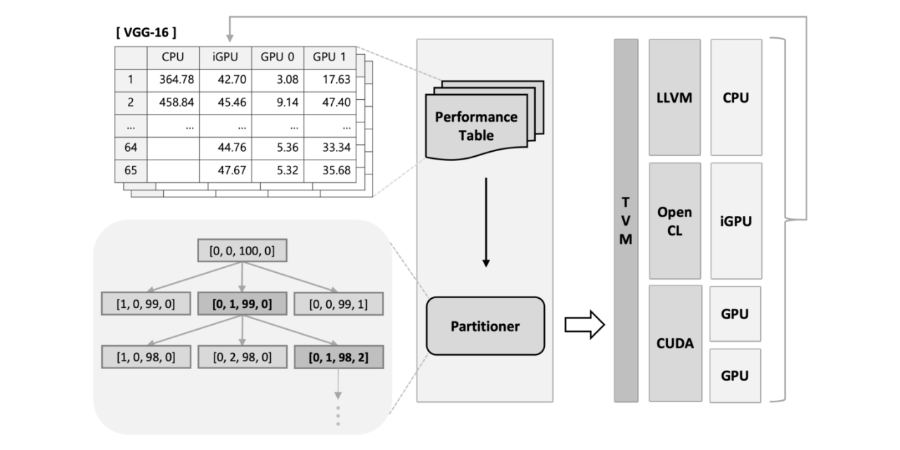
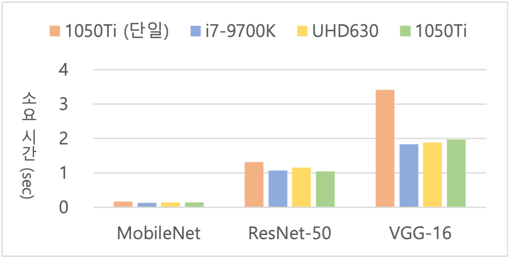

## Batch Partitioning

"이종 시스템에서의 효율적인 추론을 위한 성능 기반 배치 분배 기법 연구 (KCC2020)" 논문의 기반이 되는 코드 레포지토리입니다.

([이성주, 최경환, & 박영준. (2020). 이종 시스템에서의 효율적인 추론을 위한 성능 기반 배치 분배 기법 연구. *한국정보과학회 학술발표논문집*, 1745-1747.](https://www.dbpia.co.kr/pdf/pdfView.do?nodeId=NODE09874908&googleIPSandBox=false&mark=0&useDate=&ipRange=false&accessgl=Y&language=ko_KR&hasTopBanner=true))

<br/>

### 목차

1. [연구 개요](#연구-개요)
2. [코드 설명](#코드-설명)
3. [코멘트](#코멘트)

<br/>

### 연구 개요

#### 배경

- 모델 규모 및 기기 성능에 따라 딥러닝 모델 추론 시 오랜 시간이 소요 되면 실시간 처리 애플리케이션의 요구사항을 충족하기 어려울 수 있습니다.
- 워크로드 일부를 분배하여 이종 시스템 환경에서 유휴 상태에 있는 다른 연산 유닛들을 함께 활용하면 작업 효율을 증대시킬 수 있습니다.

<br/>

#### 제안



- 대상 모델 및 각 연산 유닛 별로 특정 배치 크기에 대한 성능 프로파일링 진행 후 성능 표에 기록합니다.
  - 이때, 효율이 비교적 크게 변할 수 있는 $2^n$ 형태의 값과 그 근처의 값들의 배치 크기를 대상으로 프로파일링을 진행합니다.
- 대상 모델과 배치 크기가 주어질 때, 해당 정보 및 프로파일링 데이터를 바탕으로 greedy algorithm을 기반으로 효율적인 배치 분배 조합 탐색을 진행합니다.
- 연산 유닛 별로 분배된 배치 크기에 따라 TVM 딥러닝 컴파일러를 활용해 플랫폼 별 모델 컴파일 진행 및 병렬 수행합니다.
  - 각 유닛에 대해 CPU는 LLVM, iGPU는 OpenCL, GPU는 CUDA 백엔드를 활용하도록 지정합니다.

<br/>

#### 결과

<p align="center"></p>

- 1050 Ti GPU 단독 활용 시 대비 i7-9700K CPU 및 이에 내장된 UHD630 iGPU와 GPU를 함께 활용할 때 특정 배치 크기에서의 처리량을 비교하고자 했습니다.
- MobileNet, ResNet-50, VGG-16 세 모델의 배치 크기를 100으로 설정하여 추론에 총 소요된 시간을 측정했습니다.
- 세 이종 연산 유닛에 데이터 병렬화 기법을 적용해 추론 소요 시간이 모델 별로 약 12~42% 가량 감소한 것을 확인했습니다.

<br/>

### 코드 설명

#### 테스트 환경

- H/W
  - CPU: Intel i7-9700K
  - iGPU: Intel UHD630
  - GPU: NVIDIA GTX 1050 Ti
  - RAM: DDR4 16GB

<br/>

- S/W
  - Ubuntu 18.04 LTS, Python 3.7
  - TVM 0.7.0dev0
  - LLVM 9.0.0, OpenCL (Intel) 2.0, CUDA 10.1

<br/>

#### Inference.py

- Python으로 해당 파일을 실행하도록 하고, 세 가지 요소에 대한 값을 인자로 제공할 수 있습니다.

  ```bash
  python3 Inference.py --network=[network name] --device=[devices] --batch=[batch size]
  ```

  - `--network`: `mobilenet`, `squeezenet_v1.0`, `squeezenet_v1.1`, `resnet-18`, `resnet-34`, `resnet-50`, `inception_v3`, `vgg-16`, `vgg-19`, `densenet-121`
  - `--device`: `cpu`, `igpu`, `gpu0`, `gpu1`, ... (여러 값들을 ','로 구분해 이어 붙일 수 있습니다.)
  - `--batch`: 1 이상의 양의 정수 (너무 큰 값을 제공하면 이를 분할한 배치 크기가 일부 유닛에서 동작하지 못 할 수도 있습니다.)

- 서로 다른 아키텍처 기반의 여러 CUDA 기반 GPU가 장착되어 있을 때, 인덱스 1번 이상의 GPU를 대상으로 문제 없이 지정하기 위해서는 다음 추가 사항 중 하나 이상 고려해야 합니다.
  - 0.8.0 버전 이후에서는 빌드 전  `tvm.autotvm.measure.measure_methods` 모듈 내 ``set_cuda_target_arch(arch)`` 메소드를 호출해 대상 아키텍처를 지정합니다.
  - NVCC를 활용할 경우 0번 GPU의 아키텍처를 기반으로 코드를 컴파일하도록 작성된 백엔드 코드를, 장착된 GPU 중 가장 낮은 아키텍처를 감지하도록 수정합니다.

<br/>

#### print_table.py

- ``Inference.py``를 실행함으로써 작성된 성능 표를 출력하며, 다음과 같이 프로파일링 정보가 기록된 파일명을 인자로 제공해 실행합니다.

  ```bash
  python3 print_table.py [table file name]
  ```

- 기록된 성능 표의 일부분을 수정할 수 있는 일부 메소드를 제공합니다. (기능 상 미완성)

<br/>

#### measure_io.py

- 특정 연산 유닛의 데이터 I/O 시간을 측정하기 위한 임시 코드입니다. 실행 시 다음과 같이 여러 인자 값을 제공할 수 있습니다.

  ```bash
  python3 measure_io.py --network=[network name] --device=[device] --batch=[batch size] \
                        --max_batch=[maximum batch size] --inc=[increments of batch size]
  ```

  - `--network`, `--device`, : ``Inference.py``의 인자와 동일
  - `--batch`: 프로파일링 대상 배치 크기 (아래 인자와 조합할 경우 프로파일링을 시작할 배치 크기 값)
  - `--inc`: 한 번의 실행으로 여러 배치 크기에 대해 프로파일링 하기 위한 배치 크기 증분 값 (기본 0)
  - `--max_batch`: 증분 값을 적용할 때 지정할 최대 배치 크기

<br/>

### 코멘트

#### 연구 동기

- 워크로드를 잘 나눠줌으로써 성능을 증대시키는 것에 관심을 갖게 되어 해당 연구를 진행하게 되었고, 이후 내용을 정리하여 제 학부연구생으로서의 첫 논문을 작성했습니다.
- 본 연구에 큰 motivation이 된 선행 연구들은 다음과 같습니다.
  - OpenCL을 활용한 CPU 및 GPU 협업 연구
    - [Lee, J., Samadi, M., Park, Y., & Mahlke, S. (2013, September). Transparent CPU-GPU collaboration for data-parallel kernels on heterogeneous systems. In *Proceedings of the 22nd international conference on Parallel architectures and compilation techniques* (pp. 245-255). IEEE.](https://ieeexplore.ieee.org/abstract/document/6618821/)
  - 모바일 환경 및 배치 크기 별로 비전 모델 추론 시 지연 시간과 처리량의 경향을 분석한 연구
    - [Hanhirova, J., Kämäräinen, T., Seppälä, S., Siekkinen, M., Hirvisalo, V., & Ylä-Jääski, A. (2018, June). Latency and throughput characterization of convolutional neural networks for mobile computer vision. In *Proceedings of the 9th ACM Multimedia Systems Conference* (pp. 204-215).](https://dl.acm.org/doi/abs/10.1145/3204949.3204975)

<br/>

#### 개선 의견

- 실험 시 더 많은 모델 및 배치 크기에 대해 병렬화 전후 성능을 비교 및 제시할 수 있었다면 그 효과를 검증하기 더 좋았을 것 같습니다.
- 최대 3장 분량 제한으로 추가하지 못했으나, 본 논문에서 활용한 세 연산 유닛의 상대적인 성능을 언급하고 일부 유닛을 활용하지 않은 각 조합 별 성능 차를 제시했다면, 각 유닛이 병렬화 성능에 미치는 영향을 더 잘 확인할 수 있었을 것 같습니다.
